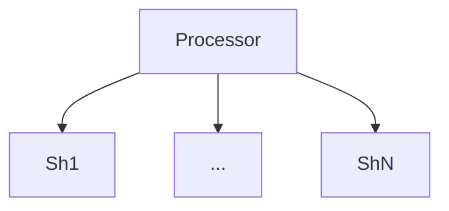
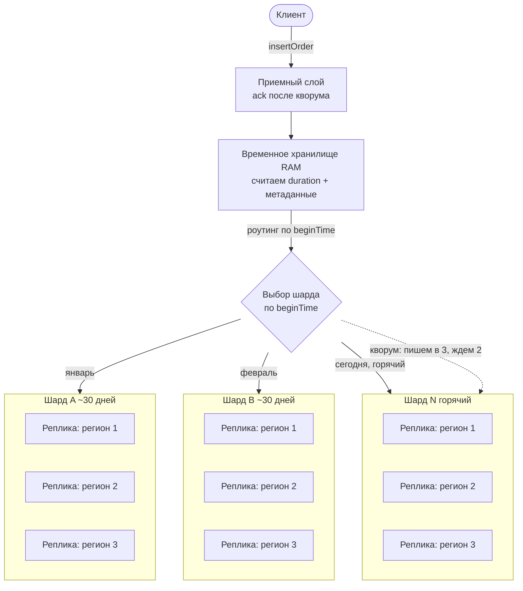

Я записал, как прохожу секцию system design из головы, не подглядывая в шпаргалки и не рисуя заранее. Просто задача, таймер и рассуждения вслух. Ниже – расшифровка того, к чему я пришел в первой половине. Это ровно тот момент проектирования, когда самое интересное только начинается: мы упираемся в то, как физически хранить файлы, понимаем, что без индекса дальше не проехать, и на этом первая запись обрывается. Индекс и путь чтения – во второй части.

## Условие

Нужно спроектировать кусочек аналитической системы для отлова фрода по заказам. API минимальный:

```
insertOrder(order: Order): void
getLongestNOrdersByDuration(n: int, startTime: datetime, endTime: datetime): Order[]
getShortestNOrdersByDuration(n: int, startTime: datetime, endTime: datetime): Order[]
```

`Order` – это блоб на 1–10 КБ с тремя выделенными полями: `orderId`, `beginTime`, `finishTime`. Два метода чтения возвращают n самых длинных или самых коротких заказов по длительности (`finishTime − beginTime`), среди тех, что стартовали в заданном окне времени.

В этой первой части я разбираю путь записи и раскладку данных по машинам. Методы чтения и то, как под них устроен индекс, оставляю на потом – к концу расшифровки я как раз до них дохожу и упираюсь в необходимость индекса.

## Ограничение, ради которого задача интересна

Начну не с методов, а с ограничения, потому что именно оно задает всю форму решения. Нельзя использовать ни одну внешнюю систему. Ни MySQL, ни Postgres, ни ClickHouse, ни Redis, ни S3. В распоряжении только машины в облаке – диски, память, процессор. Все хранилище надо построить руками.

Первое, что хочется сделать с таким ограничением – мысленно его обойти. Ну поставим Postgres, ну прикрутим S3, задача решается за вечер. Но ограничение осмысленное, и держится оно на двух вещах.

Стоимость. Если система по функциональности небогатая, а именно такая нам и досталась, то сделать все на голых дисках и виртуалках выходит очень дешево. Managed-база или объектное хранилище – это отдельная статья расходов, которая для нашего скромного набора операций не окупается.

Операционная нагрузка. Когда я строю хранилище сам, мне нужно знать ровно одну вещь – как у меня разложены данные по дискам. Диски и виртуалки, с которыми я работаю, и все. Как только сверху появляется чужая система, мне нужно знать еще и как ее обслуживать: как она ведет себя под нагрузкой, что делает на пиках, как ее чинить, когда она встанет. Она даст больше возможностей, но этих возможностей задача не требует. Так что такой запрет реалистичен ровно там, где ресурсы – и по хранению, и по людям, которые все это сопровождают – жестко ограничены.

Отдельно проговорю природу системы. Это аналитика, а не real time. Значит на чтении нет SLA по времени отклика: задача в том, чтобы данные отдать, а не отдать их за 50 миллисекунд. Это развязывает руки на пути чтения и позволяет платить временем там, где иначе пришлось бы платить железом.

## Исходный набросок: процессор над шардами

Прежде чем рассуждать строго, я накидал на доске первый, наивный набросок – чтобы было от чего отталкиваться и что потом перекраивать. Сверху процессор (позже он у меня распадется на приемный слой и роутер), под ним шарды от первого до N-го: процессор разводит запись и сводит чтение.



Первый ключ шардирования у меня был лобовой – `ShardKey = UnixTimeStamp % 360`, раскидать заказы примерно по 360 шардам, по одному на день года. Ниже я его разберу и заменю: остаток размазывает соседние даты по разным шардам, а мне нужно ровно обратное – чтобы запрос за период попадал в несколько соседних шардов, а не во все сразу.

Заказ на доске я разложил так:

- `ID` – 20 символов, Guid;
- `Date` – UnixTimeStamp начала;
- `Length` – int, длительность, которую я считаю заранее и кладу в метаданные, а не пересчитываю на чтении;
- `Path` – до 2000 символов, путь к блобу, JSON или байт-строка;
- `Decoder` – декодер тела.

Путь чтения (`getN`) я на доске тоже набросал, но его честно откладываю на вторую часть – он весь про индекс, а до индекса нам еще надо дойти.

## Значит, система распределенная

Из ограничения и из требования надежности сразу следует форма. Аналитическая система с постоянным потоком записи должна работать условно 99,9% времени. Одна машина – это одна точка отказа: диск умер, и мы потеряли и данные, и доступность. Значит система обязана быть распределенной. Больше одного сервера, больше одной ноды. Это ограничение всплывает еще до того, как я начал что-либо рисовать, прямо из целевой доступности.

## И, скорее всего, размазанная по регионам

Раз мы уже говорим о распределенности ради надежности, стоит дотянуть эту мысль до географии. Держать всю сотню машин в одном дата-центре – значит снова собрать точку отказа, только крупнее: пожар, сеть, питание в одной зоне кладут систему целиком. Поэтому реплики хочется разносить по нескольким регионам.

Не буду переоценивать этот ход, у него есть цена. Тянуть согласование записи между регионами дорого по задержкам, и для строгой консистентности это был бы плохой размен. Но у нас аналитика без SLA на отклик, поток однонаправленный, и это ровно тот случай, когда географическое разнесение оправдано:

- durability и доступность – потеря целого региона не уносит данные и не роняет прием;
- disaster tolerance – система переживает отказ уровня зоны, а не только уровня машины;
- прием ближе к источнику – заказы можно принимать в регионе, где они возникают, а тяжелую раскладку и синхронизацию доигрывать асинхронно. У этого удобства есть цена – кворум между регионами, к этой развилке я вернусь в открытых вопросах.

То есть многорегиональность здесь – не про скорость чтения, а про то же требование надежности, просто доведенное до его логического конца. За это мы платим сложностью синхронизации между регионами, и с этой ценой соглашаемся осознанно.

## Прикидка на салфетке

Теперь, когда понятно, что машин будет много и стоят они в разных местах, посчитаем, сколько именно. Объем – это то, что диктует количество железа.

- 10 млн файлов заказов в сутки.
- Размер файла берем по максимуму – 10 КБ.
- Пик записи – около 1000 операций в секунду.

Считаем хранение за год. 10 млн файлов в день по 10 КБ дает порядка 35 ТБ сырых данных за год. Мы заранее знаем, что будем реплицировать в три копии, поэтому закладываем порядка 100 ТБ дискового пространства. Если брать по 1 ТБ диска на машину, выходит около 100 машин, чтобы хранить все это добро. Диски побольше – машин поменьше, тут прямая арифметика. Вот откуда берется сотня нод, которую мы дальше будем раскладывать по шардам и регионам.

## Путь записи: принять быстро, обработать потом

Мы работаем в одну сторону – данные только пишутся, поэтому сам прием можно сделать простым и быстрым. Но здесь важная поправка, которую я сначала проговорил неаккуратно. Для системы, где данные терять нельзя, «принято» не может означать «подержал в памяти и сразу ответил». Пока заказ не закреплен на нескольких машинах, он не принят. Поэтому клиенту я отвечаю «принято» только после того, как заказ надежно лег на кворум реплик (про кворум – ниже). А вот тяжелую доработку – финальную раскладку на диске и обновление индекса – уже можно унести в асинхронную обработку после ответа. То есть асинхронна не durability, а последующая возня с укладкой данных.

Дальше – предобработка, и это ключевой момент. Прежде чем куда-то раскладывать заказ, я считаю его длительность один раз, при записи, а не каждый раз при чтении. И сохраняю рядом метаданные, по которым потом будет идти фильтрация:

- `orderId`,
- длительность (`finishTime − beginTime`), потому что по ней сортируют оба метода чтения,
- время начала заказа (`beginTime`), потому что по нему фильтруют по окну времени – и, как увидим ниже, по нему же шардируют.

Логика такая: сырой файл падает во временное хранилище, например в оперативную память. Там мы считаем длительность, формируем метаданные, и уже осознанно отправляем заказ на нужный сервер – в зависимости от его `beginTime`. То есть запись – это не "положить файл на диск", а "принять, посчитать, направить" – и подтвердить клиенту только после того, как кворум реплик закрепил заказ.

## Шардирование по времени начала заказа

Теперь главный вопрос раскладки: как распределить файлы по сотне машин?

В чате во время разбора всплыл соблазнительный вариант – один день недели на один сервер. Семь серверов, и все закрыто. Я его отбросил, и по двум причинам.

Во-первых, потолок. Семь серверов – это ровно семь серверов. Данных у нас на сотню машин, так что схема не масштабируется в принципе.

Во-вторых, перекос нагрузки и запросов. Заказов в будни и в выходные разное количество, так что данные лягут по серверам неравномерно. А запрос за период, скажем с 1 по 31 мая, придется размазать параллельными запросами по всем семи машинам сразу, и каждая будет перегружена.

Поэтому ключ шардирования – время начала заказа, `beginTime`. И это осознанный выбор: `beginTime` – ровно то поле, по которому фильтруют оба метода чтения (окно `startTime`–`endTime` задается по времени старта заказа). Когда шардируешь по тому же измерению, по которому потом фильтруешь, запрос за период задевает только несколько соседних шардов, а не размазывается по всем. Шардировать по времени приема было бы ошибкой: заказы приходят с задержкой и не по порядку, и тогда фильтр по `beginTime` перестал бы совпадать с раскладкой. Считаем по объему, сколько дней помещается на один сервер, и получаем что-то вроде 30 дней на шард. Заказы, стартовавшие в январе, попадают на январский шард, и после того как январь закрыт, на запись мы туда практически не возвращаемся. Плюсы:

- Запрос за конкретный период превращается в арифметику: по датам вычисляем, какие шарды задеты, и шлем запрос только на них, параллельно. Не на все сто машин, а на те несколько, где реально лежат нужные дни.
- Холодные данные отделены от горячих. Старые шарды спокойно лежат, их никто не трогает записью.

Минус у схемы честный, и я его не прячу. Горячая точка записи всегда на последнем шарде – на сегодняшнем дне. Она постоянно смещается вперед во времени, вслед за текущей датой. С этим перекосом придется жить, но выбор осознанный: предсказуемая горячая точка лучше, чем равномерно размазанный хаос.

## Реплики и кворум: шард – это кластер из трех

Один сервер на шард – это риск потери данных, на который мы пойти не можем. Поэтому шард у меня – не машина, а кластер из трех одинаковых серверов, которые держат одни и те же данные, и эти три сервера хочется разнести по регионам из тех же соображений, что и выше.

Три сервера идентичны и обрабатывают запросы одинаково – и на запись, и на чтение. Балансировать между ними ничего не нужно: запрос приходит на все три и обрабатывается на всех трех симметрично.

Почему именно три? Ради надежности с запасом на восстановление. Отказ одной машины не роняет шард: две оставшиеся работают, а у нас появляется время поднять замену, восстановить на ней данные и вернуть шард в полный состав. Была бы одна машина – при ее потере мы просто сидим и трясемся над единственной копией.

Запись в шард идет через кворум. Направив заказ в нужный кластер по его `beginTime`, я шлю его на все три сервера параллельно, но жду подтверждения только от двух. Как только две машины сказали "записал" – запись считается надежной, третья меня в этот момент не волнует. Двух зафиксированных копий достаточно, чтобы данные не потерялись. Как потом догнать и синхронизировать третью – это уже вопрос следующего слоя, к пути записи он отношения не имеет.

Собираю путь записи целиком: приняли файл, положили во временное хранилище (RAM), посчитали длительность и метаданные, по `beginTime` выбрали шард, разослали на все три реплики в разных регионах, дождались двух подтверждений – и только тогда ответили клиенту «принято».



## Ввод и вывод машины: замена реплики и рост без ребаланса

Раз шард – это кластер из трех, надо ответить на честный операционный вопрос: что происходит, когда машину выводят на обслуживание или меняют выпавшую, и как система растет со временем.

Замена реплики. Отказ одной из трех машин шард не роняет – две оставшиеся держат кворум и на запись, и на чтение. А вот как поднимать замену, зависит от того, горячий шард или холодный. Холодный шард (закрытый месяц) на запись больше не меняется, данные иммутабельны, поэтому новую машину я поднимаю простым bulk-копированием файлов с живой реплики, без всякой живой сверки. Горячий шард (сегодняшний) меняется прямо сейчас, поэтому новую реплику я сначала заливаю снапшотом, а потом догоняю по логу дозаписи, пока она не поравняется с двумя работающими, и только тогда возвращаю в кворум.

Вывод на обслуживание. Тот же принцип наоборот: вывожу одну реплику, шард живет на двух, делаю что нужно, возвращаю с догоном. Правило одно – никогда не трогаю две из трех в одном шарде одновременно.

Рост без ребаланса. Вот где шардирование по времени по-настоящему окупается: старые данные не переезжают. Нужно больше емкости – я не перекладываю уже разложенное, а просто нарезаю новые шарды под будущие диапазоны дат. Если суточный объем вырос настолько, что 30-дневный шард переполнится, я делаю будущие шарды короче, скажем по 15 дней, а прошлые оставляю как есть. «Ребаланс» здесь почти всегда сводится к append-only: историю я не двигаю. Это ровно та причина, по которой шардирование по диапазону времени выигрывает у раскидывания по остатку – там любой рост означал бы переезд данных.

## Куда упирается хранение внутри шарда: файлы, inode и индекс

Данные разложены по шардам и репликам. Осталась самая приземленная деталь – как физически хранить файлы внутри одного шарда. И здесь наивный вариант упирается в очень конкретную стену.

Если не пробовали, попробуйте: создайте один каталог с десятью миллионами мелких файлов по 1–10 КБ и сделайте на нем `ls`. Вы обнаружите, что даже просто вывести список – нетривиальная работа для операционной системы. Один каталог на 10 млн файлов упирается в ограничения файловой системы: каждый файл – это inode, чтение их метаданных долгое, поиск по каталогу медленный. А диск при этом постоянно занят чтением, и записать на него что-то параллельно уже толком не выходит.

Значит, хранение внутри шарда надо организовать. Дальше видятся два пути.

Первый – раскладывать файлы по каталогам, скажем не больше 4000 файлов на каталог, структурируя их по датам. Появляется структура, а зная структуру, можно ускорять чтение.

Второй – хранить все в одном большом файле, дописывая новое содержимое в конец, и держать где-то бинарное смещение каждого заказа внутри этого файла. Это, по сути, ровно то, как работает база данных.

И вот тут развилка сходится в одну точку. При любом из вариантов честный поиск сводится к одному и тому же: гонять один гигантский файл целиком в память – ресурсно неблагодарно; перебирать 10 млн файлов за один день – ровно так же неблагодарно. И в том, и в другом случае нужен индекс, который упростит поиск и навигацию по всему этому хозяйству.

Как построить этот индекс – под фильтр по `beginTime` и сортировку по длительности, так, чтобы два метода чтения работали, не поднимая терабайты в память – это и есть содержание второй части.

## Открытые вопросы, которые я оставляю честно открытыми

Ядро дизайна собрано, но не все развилки я закрыл в первой части, и часть оставляю открытыми сознательно. На системном дизайне это нормально – проговорить вслух место, где однозначного ответа нет.

- Кворум между регионами против быстрого приема. Я хочу и разносить реплики по регионам ради disaster tolerance, и подтверждать запись быстро. Но если две из трех реплик лежат в разных регионах, то кворум 2 из 3 включает межрегиональный round-trip, и «быстро» превращается в задержку WAN. Либо кворум внутри одного региона (тогда потеря региона может унести незареплицированное), либо через регионы (тогда прием медленный). Где провести эту границу – открытый вопрос, и зависит от того, что дороже: секунды на приеме или сценарий потери целого региона.
- Идемпотентность и дубликаты. `insertOrder` по ненадежной сети с ретраями рано или поздно приедет дважды. Естественный ключ дедупликации – `orderId`, но саму дедупликацию и защиту от коллизий при работе на нескольких серверах я в этой версии не проектировал. Это то, что нужно добить, прежде чем называть систему надежной.
- Наблюдаемость. Managed-систем мы себе запретили, значит и готовых дашбордов «реплика отстала», «шард перегрелся», «inode заканчиваются» никто не принесет – их придется строить самому. Это тема отдельной, следующей записи.

## Разбор в чате: вопросы и гипотезы

Этот кейс я разобрал не только в голове, но и вживую [в чате сообщества](https://telegram.me/teamleads_kz/57725). Несколько человек по очереди пробовали спроектировать систему, а я гонял их вопросами – ровно как на секции system design. Получилась хорошая карта того, обо что спотыкаешься, и несколько гипотез, часть которых честно спорит с моим выводом про индекс.

### Вопросы, на которые стоит ответить самому

По ходу разбора я [собрал список](https://telegram.me/teamleads_kz/57873) – если хотите проверить себя, пройдитесь по нему прежде, чем читать вторую часть:

1. Как сделать так, чтобы файлы не терялись при потере сервера – например, диск рассыпался в момент записи или чтения?
2. Как обеспечить скорость записи 1000 запросов в секунду?
3. Когда считать длительность – в момент запроса или заранее?
4. Сколько оперативной памяти нужно, чтобы собрать данные за год?
5. Какие сложности с хранением 30 млн файлов – на уровне одной ОС, на уровне одного каталога?
6. Если серверов больше одного – как обеспечить запись и чтение?
7. Как организовать хранение на диске – множество файлов или один большой blob?
8. Нужен ли индекс?
9. Если нужен – зачем и какой структуры?
10. Что делать, когда один сервер выводят на обслуживание, а другой добавляют? Как синхронизировать?
11. Как убедиться, что при работе больше чем на одном сервере нет коллизий?

К списку [добавился вопрос от Артура](https://telegram.me/teamleads_kz/57866): SSD это или HDD? На SSD можно спокойно класть тысячи мелких файлов, на HDD случайная запись убивает производительность – и это уже повод группировать файлы программно.

### Гипотезы участников

- **Кодировать метаданные в имя файла.** [Азат предложил](https://telegram.me/teamleads_kz/57757) имя вида `{start}-{duration}-{id}.json` и идти по каталогу итерацией, читая только имена. Дешево и без отдельного индекса, но упирается ровно в тот самый медленный обход миллионов файлов.
- **Раз нет SLA на чтение – зачем вообще индекс?** [Тоже Азат](https://telegram.me/teamleads_kz/57753): отправить один и тот же запрос на все серверы, слить результаты сортировкой, читать построчно. Честная контр-гипотеза к моему выводу. Мой ответ был встречным вопросом: ты правда готов гонять итерацией 30 террабайт на каждый запрос?
- **WAL вместо JSON-индекса.** [Андрей](https://telegram.me/teamleads_kz/57732) сразу отмел JSON и предложил write-ahead log, по сути event sourcing – дописываем в конец, а индекс поднимаем поверх.
- **S3-подобная обертка с двумя индексами.** [Артур](https://telegram.me/teamleads_kz/57824) зашел со стороны «построим свой S3»: первичный объект – блоб, а сверху два индекса, `(дата создания, orderId)` и `(дата окончания, orderId)`, чтобы закрыть обе сортировки.
- **Один файл на день, 365 каталогов.** [Василий](https://telegram.me/teamleads_kz/57880) предложил самый прямой путь – раскладывать по дням. Ровно на нем и [всплыла тема inode](https://telegram.me/teamleads_kz/57902): «No space left on device» при свободном диске, `Argument list too long`, медленный `ls`, дорогой rsync. Тот самый наивный вариант, о который спотыкается решение.
- **Узкое место – не throughput, а IOPS.** [Михаил посчитал нагрузку](https://telegram.me/teamleads_kz/57964): ~1 МБ/с по полосе – мизер, потянет и одиночный HDD. Но 1000 мелких случайных записей в секунду – это тысячи случайных IOPS, и вот это уже аргумент за flash, а не за диски. Полезное напоминание, что «объем маленький» и «нагрузка легкая» – разные вещи.
- **А должна ли наша система вообще писать?** [Михаил же поставил под сомнение саму рамку](https://telegram.me/teamleads_kz/57954): антифроду нужно только читать, писать в реалтайме может боевая БД, а нам хватит ежесуточной выгрузки. По условию задачи писать надо нам – но на реальном интервью такой вопрос к постановке дорогого стоит.

Отдельно отмечу мысль, которая прозвучала в разборе: решение на system design – это не финальная схема, а [сам процесс задавания вопросов](https://telegram.me/teamleads_kz/57940) и [список операционных параметров](https://telegram.me/teamleads_kz/57943) той системы, что ты в итоге собрал.

Продолжение – во второй части.
